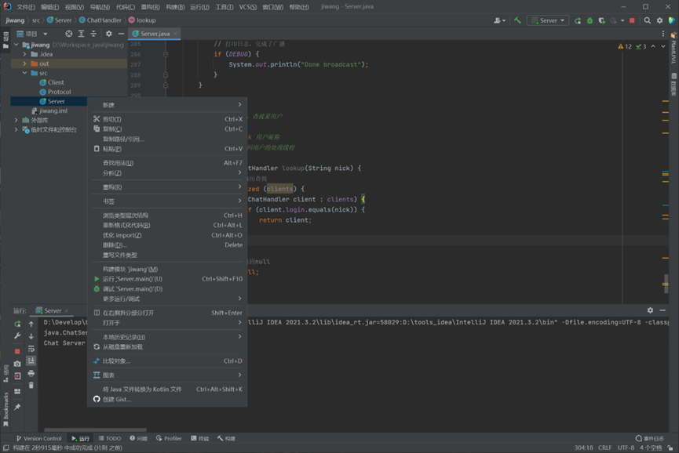
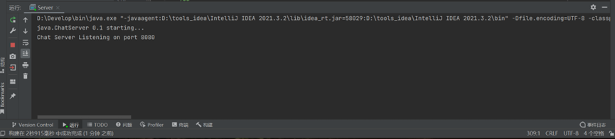
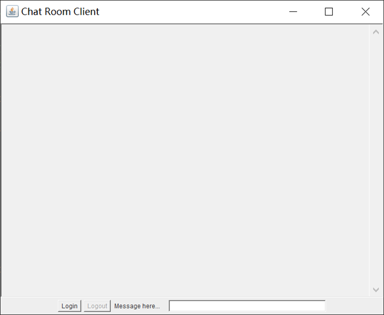
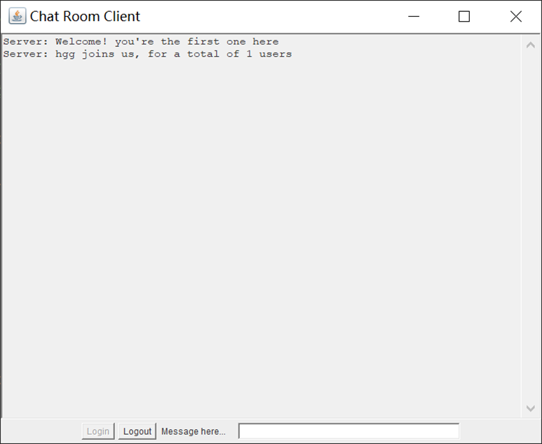
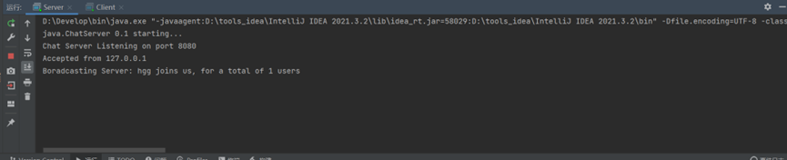
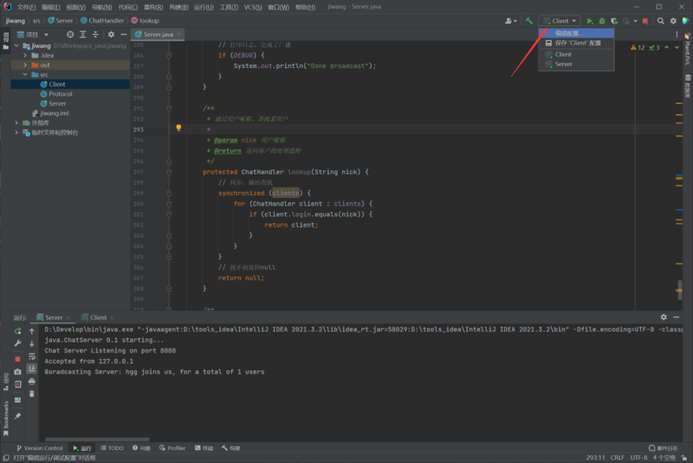
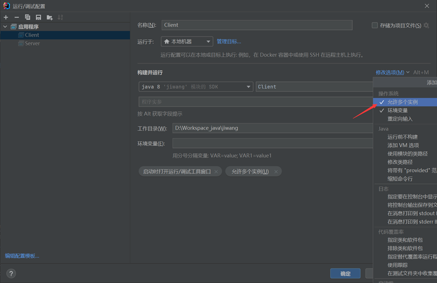
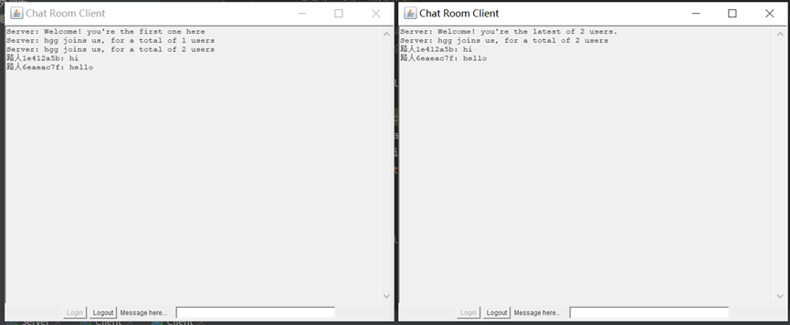

计算机网络大作业
多线程webserver-多人公共聊天室

姓名：黄国桂
学号：2020141470393
学院：建筑与环境学院
版本：1.0
日期：2022年6月10日

一、	运行环境

编程语言：java
Jdk版本：1.8
IDE：Idea 2021版
端口号：8080
服务器ip：localhost(本地，为了调试方便选用了本地，也可以更改ip地址，这样就可以实现不同电脑通信，但需要接入同一个局域网)

二、	软件说明
本软件实现了多人公共聊天室。

2.1 此程序设计了三个类：客户端、协议、服务器

2.2程序运行

首先启动服务器。选择Server类右键运行

运行成功后如下图

接着运行客户端，方法与上述运行服务器相同，出现如下界面：

点击login登录，成功后界面如下

此时控制台中出现下述

2.3多开客户端
在idea中多开客户端实现聊天的方法如下：

点击编辑配置然后按下述打勾选项之后确定即可

2.4实现聊天
在上述步骤后，继续运行客户端即可得到新的用户。按2.2步正常登录后即可实现聊天。若想退出聊天室，点击logout即可注销。

